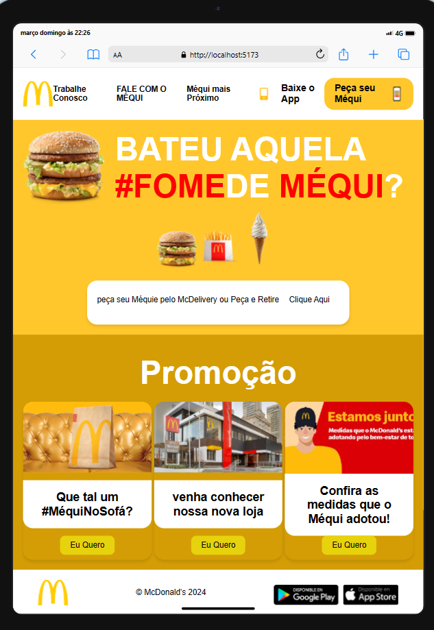

## Visão Geral

# Site McDonald
é uma aplicação frontend desenvolvida utilizando React.js e gerenciamento de estado com useState. Foi criado como parte do meu portfólio pessoal para demonstrar minhas habilidades em frontend e minha proficiência no uso do React.js.
Este é um projeto desenvolvido com o objetivo apenas para aprimorar habilidades de desenvolvimento web, servindo como uma plataforma para estudo e prática. Vale ressaltar que este projeto não possui afiliação oficial com o McDonald's ou qualquer outra marca mencionada.

## Funcionalidades Principais
- [x] Página inicial com imagens clicáveis para exibição dinâmica.
- [x] Troca dinâmica de imagens ao clicar em diferentes elementos.
- [x] Seção de promoções com cards responsivos.

## Tecnologias Utilizadas

- Linguagens: HTML, CSS, JavaScript

- Frameworks/Libraries: React.js, styled-components
  
- Outras Ferramentas: Git, GitHub

## Como Executar o Projeto

1. Clone o repositório: `git clone https://github.com/seu-usuario/nome-do-repositorio.git`
2. Navegue até o diretório do projeto: `cd nome-do-repositorio`
3. Instale as dependências: `npm install`
4. Execute o projeto: `npm run dev`

## Capturas de Tela

*Página inicial com imagens clicáveis para exibição dinâmica.*

## Contribuição

Contribuições são sempre bem-vindas! Caso queira contribuir para este projeto, siga estas etapas:

1. Fork o projeto
2. Crie sua branch de feature: `git checkout -b feature/NovaFeature`
3. Commit suas alterações: `git commit -am 'Adicionar NovaFeature'`
4. Envie para a branch: `git push origin feature/NovaFeature`
5. Abra um pull request

## Contato

- **Renato Filho**
- **Email:** renatoservicesti@gmail.com
- **LinkedIn:** [linkedin.com/in/Renatofilho](https://www.linkedin.com/in/renato-filho-devandtech)
- **GitHub:** [github.com/RenatofilhoDevandtech](https://github.com/RenatofilhoDevandtech)

## Direitos Autorais das Imagens
As imagens utilizadas neste projeto foram obtidas do site oficial do McDonald's (https://www.mcdonalds.com/), com o propósito exclusivo de fins educacionais e de aprendizado. É importante destacar que essas imagens são propriedade do McDonald's e estão sujeitas aos direitos autorais da empresa.

## Aviso Legal
Este projeto é estritamente destinado a fins de estudo e prática. Qualquer uso comercial ou redistribuição do conteúdo deste projeto sem autorização prévia pode infringir os direitos autorais e outras leis aplicáveis.

## Contato
Caso você seja o proprietário dos direitos autorais de qualquer conteúdo utilizado neste projeto e tenha alguma preocupação relacionada à sua utilização, por favor, entre em contato comigo para que possamos resolver a questão de forma adequada.

## Sinta-se à vontade para entrar em contato comigo se tiver alguma dúvida ou sugestão sobre o projeto. Agradeço pelo interesse!

